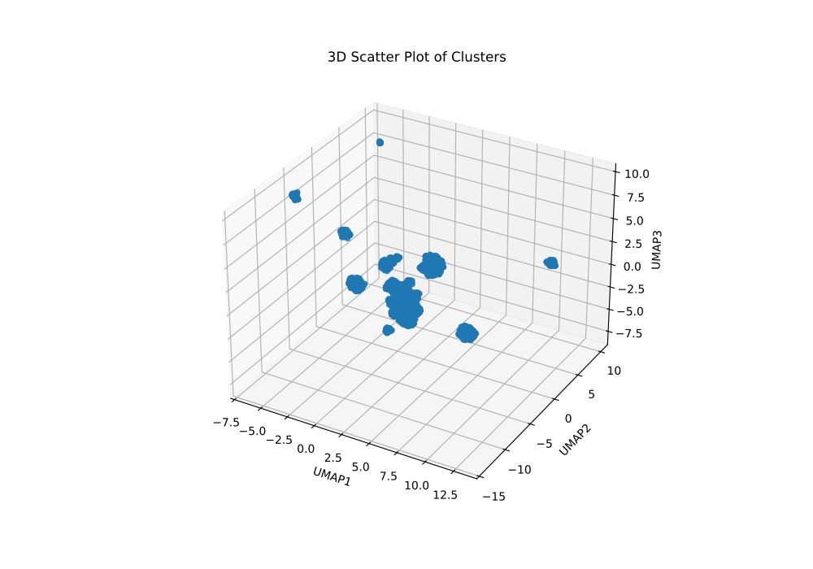
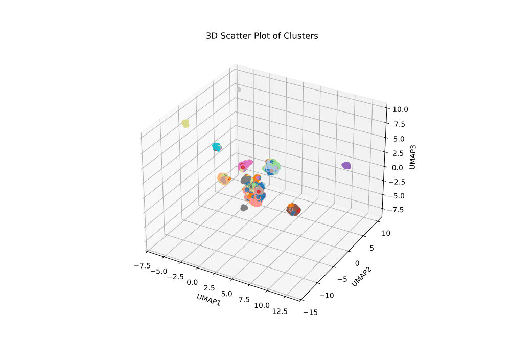

# README: Customer Clustering for Retail Business

## Overview
This project focuses on clustering the customer base of a retail business based on their characteristics and behaviors. The objective is to uncover meaningful patterns that help in understanding customer segments, which can assist in targeted marketing, personalization, and strategic decision-making.

Without dimensionality reduction, the high dimensionality of the dataset makes it impossible to identify meaningful patterns, as evidenced by low silhouette scores in clustering attempts. Leveraging **UMAP (Uniform Manifold Approximation and Projection)** for dimensionality reduction drastically improves the clustering quality. Among the clustering methods explored, **DBSCAN** with UMAP achieves the highest silhouette score of **0.70**, indicating well-separated and meaningful clusters.

---

## Workflow

### 1. **Data Preparation**
- **Raw Data Cleaning**: Removed rows with missing `Transaction_ID` and `Customer_ID`, converted categorical variables to numerical formats, and created dummy variables for multi-class categorical features.
- **Feature Engineering**: Aggregated transaction-level data by customer and scaled numerical features using `StandardScaler`.

### 2. **Dimensionality Reduction**
UMAP was applied to reduce the dataset to three dimensions, making it suitable for visualization and clustering while preserving the underlying data structure.

- **Visualization**:  
  

### 3. **Clustering Techniques**
Several clustering algorithms were evaluated both with and without dimensionality reduction:

#### Without Dimensional Reduction
- **K-Means Clustering**: Suboptimal clusters with low silhouette scores.  
  

#### With Dimensional Reduction (UMAP)
- **K-Means Clustering**: Improved silhouette scores due to reduced dimensions.  
  
- **Agglomerative Clustering**: Explored hierarchical relationships between customers.  
  
- **DBSCAN**: Achieved the best silhouette score (**0.70**), highlighting dense clusters of customers.  
  
- **Gaussian Mixture Models (GMM)**: Identified probabilistic clusters.  
  

### 4. **Imputation of Missing Labels**
For customers with missing cluster assignments, a **K-Nearest Neighbors (KNN)** classifier was used to impute labels based on their UMAP coordinates.

- **Final Clusters Visualization**:  
  

### 5. **Output**
The final dataset, including customer segments, was saved as `new_retail_customer_clustering.csv` in the `data/processed` directory.

---

## Key Results
- **Dimensionality Reduction Impact**: UMAP significantly improved clustering quality, as reflected in higher silhouette scores.
- **Best Clustering Method**: DBSCAN achieved the best performance with a silhouette score of **0.70**.
- **Customer Insights**: Meaningful segments of customers were identified, which can be leveraged for actionable business strategies.

---

## Requirements
### Python Libraries
- `pandas`
- `numpy`
- `scikit-learn`
- `scipy`
- `umap-learn`
- `matplotlib`

Install the required libraries using:
```bash
pip install -r requirements.txt
```

## Usage

1. **Preprocess Data**: Load your retail dataset and follow the cleaning and transformation steps.

2. **Run the Script**:
   Run the following Python script to perform clustering:  ```src/clustering.py```
  
3. **Analyze Results**: Review the generated cluster visualizations and output file:
    - Cluster visualizations are saved in the ```artifacts/imgs directory```.
    - Final dataset with clusters is saved as ```data/processed/new_retail_customer_clustering.csv```.

## Visualizations

### Dimensionality Reduction:


### Clustering Examples:
#### DBSCAN Clustering:


#### Final Cluster Visualization:


---

## Future Enhancements
- Incorporate additional customer behavioral metrics.
- Experiment with advanced dimensionality reduction techniques (e.g., t-SNE).
- Apply clustering results to real-world marketing strategies.