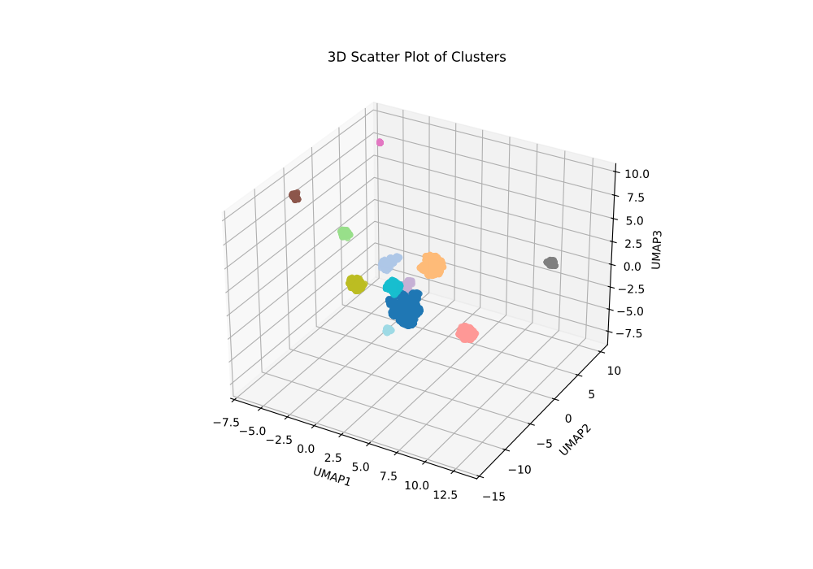
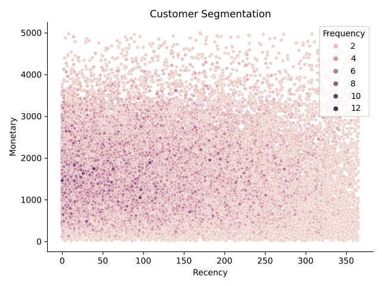
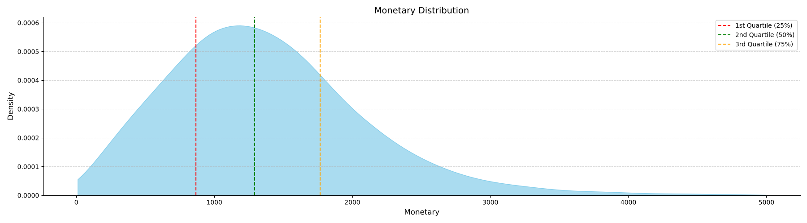

# Customer Clustering for Retail Business

## Overview
This project focuses on clustering the customer base of a retail business based on their characteristics and behaviors. The objective is to uncover meaningful patterns that help in understanding customer segments, which can assist in targeted marketing, personalization, and strategic decision-making.

Without dimensionality reduction, the high dimensionality of the dataset makes it impossible to identify meaningful patterns, as evidenced by low silhouette scores in clustering attempts. Leveraging **UMAP (Uniform Manifold Approximation and Projection)** for dimensionality reduction drastically improves the clustering quality. Among the clustering methods explored, **DBSCAN** with UMAP achieves the highest silhouette score of **0.70**, indicating well-separated and meaningful clusters.

---

## Workflow

### 1. **Data Preparation**
- **Raw Data Cleaning**: Removed rows with missing `Transaction_ID` and `Customer_ID`, converted categorical variables to numerical formats, and created dummy variables for multi-class categorical features.
- **Feature Engineering**: Aggregated transaction-level data by customer and scaled numerical features using `StandardScaler`.

### 2. **Dimensionality Reduction**
UMAP was applied to reduce the dataset to three dimensions, making it suitable for visualization and clustering while preserving the underlying data structure.

- **Visualization**:  
  

### 3. **Clustering Techniques**
Several clustering algorithms were evaluated both with and without dimensionality reduction:

#### Without Dimensional Reduction
- **K-Means Clustering**: Suboptimal clusters with low silhouette scores.  
  

#### With Dimensional Reduction (UMAP)
- **K-Means Clustering**: Improved silhouette scores due to reduced dimensions.  
  
- **Agglomerative Clustering**: Explored hierarchical relationships between customers.  
  
- **DBSCAN**: Achieved the best silhouette score (**0.70**), highlighting dense clusters of customers.  
  
- **Gaussian Mixture Models (GMM)**: Identified probabilistic clusters.  
  

### 4. **Imputation of Missing Labels**
For customers with missing cluster assignments, a **K-Nearest Neighbors (KNN)** classifier was used to impute labels based on their UMAP coordinates.

- **Final Clusters Visualization**:  
  

### 5. **Output**
The final dataset, including customer segments, was saved as `new_retail_customer_clustering.csv` in the `data/processed` directory.

---

## Key Results
- **Dimensionality Reduction Impact**: UMAP significantly improved clustering quality, as reflected in higher silhouette scores.
- **Best Clustering Method**: DBSCAN achieved the best performance with a silhouette score of **0.70**.
- **Customer Insights**: Meaningful segments of customers were identified, which can be leveraged for actionable business strategies.

---

## Requirements
### Python Libraries
- `pandas`
- `numpy`
- `scikit-learn`
- `scipy`
- `umap-learn`
- `matplotlib`

Install the required libraries using:
```bash
pip install -r requirements.txt
```

## Usage

0. **Download Data**: Download the necessary dataset from kaggle at [retail analysis large dataset](https://www.kaggle.com/datasets/sahilprajapati143/retail-analysis-large-dataset).

1. **Preprocess Data**: Load your retail dataset and follow the cleaning and transformation steps.

2. **Run the Script**:
   Run the following Python script to perform clustering:  ```src/clustering.py```
  
3. **Analyze Results**: Review the generated cluster visualizations and output file:
    - Cluster visualizations are saved in the ```artifacts/imgs/imgs directory```.
    - Final dataset with clusters is saved as ```data/processed/new_retail_customer_clustering.csv```.

## Visualizations

### Dimensionality Reduction:


### Clustering Examples:
#### DBSCAN Clustering:


#### Final Cluster Visualization:


---

## Future Enhancements
- Incorporate additional customer behavioral metrics.
- Experiment with advanced dimensionality reduction techniques (e.g., t-SNE).
- Apply clustering results to real-world marketing strategies.

# RFM Segmentation for Customer Analysis

This project contains a Python script that performs Recency, Frequency, and Monetary (RFM) analysis on retail transaction data, segments customers based on their RFM scores, and visualizes the results. RFM analysis is commonly used in customer segmentation to understand customer behaviors and target marketing efforts.

## Prerequisites

- Python 3.7+
- Libraries: `pandas`, `matplotlib`, `seaborn`, `mpl_toolkits`
  
Install the necessary libraries using the following command:

```bash
pip install -r requirements.txt
```

## Files

- **`new_retail_data.csv`**: Raw retail transaction data used for analysis. It should be placed in the `data/raw/` directory.
- **`new_retail_customer_clustering.csv`**: Processed customer data with clustering information, expected in the `data/processed/` directory.
- **Generated visualizations**:
  - `RFM_distribution.png`: Scatter plot visualizing Recency vs. Monetary, with color based on Frequency.
  - `Recency.png`: KDE plot showing the distribution of Recency scores.
  - `Frequency.png`: KDE plot showing the distribution of Frequency scores.
  - `Monetary.png`: KDE plot showing the distribution of Monetary scores.
  - `RFM_segments.png`: 3D plot visualizing Recency, Frequency, and Monetary scores, with RFM segmentation.

## Code Overview

### 1. Data Cleaning

The data cleaning process starts by loading the raw retail data from `new_retail_data.csv`. The following steps are applied:
- The relevant columns (`Transaction_ID`, `Customer_ID`, `Date`, and `Total_Amount`) are selected.
- Rows with missing values are dropped.
- The `Transaction_ID` and `Customer_ID` columns are converted to integers.
- The `Date` column is standardized to the `YYYY/MM/DD` format.

### 2. RFM Computation

RFM (Recency, Frequency, Monetary) metrics are calculated as follows:
- **Recency**: The number of days since the customer's most recent purchase.
- **Frequency**: The total number of transactions a customer has made.
- **Monetary**: The average spend of the customer.

These metrics are calculated by grouping the data by `Customer_ID`, and new columns for `Recency`, `Frequency`, and `Monetary` are created.

### 3. RFM Scoring and Segmentation

- **Recency**, **Frequency**, and **Monetary** scores are each assigned based on quartiles, giving each customer a score between 1 and 4.
- The total **RFM_Score** is calculated by combining these individual scores:  
  `RFM_Score = Recency_Score * 100 + Frequency_Score * 10 + Monetary_Score`
- Customers are segmented into the following categories based on their RFM scores:
  - **Champion**: High Recency, Frequency, and Monetary.
  - **Promising**: High Recency.
  - **Loyal**: High Frequency.
  - **Big Spender**: High Monetary.
  - **At Risk**: Low Recency but potentially high Frequency or Monetary.
  - **Lost**: Low Recency, Frequency, and Monetary.

### 4. Data Visualization

The script generates several plots to visualize the RFM segmentation:

#### 1. Scatter Plot: RFM Distribution  
A scatter plot showing Recency vs. Monetary, with points colored by Frequency.  


#### 2. KDE Plots for Recency, Frequency, and Monetary  
These density plots show the distribution of each RFM metric with quartile markers:  
- **Recency Distribution**  
  
  
- **Frequency Distribution**  
  

- **Monetary Distribution**  
  

#### 3. 3D Scatter Plot: RFM Segments  
A 3D scatter plot visualizing Recency, Frequency, and Monetary, color-coded by customer segments.  


### 5. RFM Segmentation Function

The `RFM_segmentation()` function assigns customers to different segments based on their RFM scores. The logic is as follows:
- **High Recency**: Customers who bought recently and are categorized into "Champion", "Loyal", "Big Spender", or "Promising".
- **Low Recency**: Customers who haven't purchased recently but may still be "At Risk" or "Lost", depending on their Frequency and Monetary scores.

### 6. Final Visualization with Clustering (Optional)

The script merges the RFM segmented customer data with clustering results (`UMAP1`, `UMAP2`, `UMAP3`), then creates a 3D scatter plot to visualize customer segments in a reduced-dimensional space. This visualization is generated using the clustering data from the `new_retail_customer_clustering.csv` file.

#### Clustering Visualization  
A 3D scatter plot visualizing RFM segments in reduced-dimensional space after clustering.  
 *(same plot reused for demonstration)*

## How to Run

0. Download the necessary dataset from kaggle at [retail analysis large dataset](https://www.kaggle.com/datasets/sahilprajapati143/retail-analysis-large-dataset).
1. Prepare the dataset by placing `new_retail_data.csv` in the `data/raw/` directory and `new_retail_customer_clustering.csv` in the `data/processed/` directory.
2. Run the Python script to perform RFM segmentation and generate the visualizations:

```bash
python src/RFM.py
```

3. The generated visualizations will be saved in the artifacts/imgs/ directory. These include plots for the RFM distribution, Recency, Frequency, and Monetary distributions, as well as the segmented 3D visualization.

## Conclusion
RFM segmentation is a powerful technique for understanding customer behavior. By categorizing customers based on their recency, frequency, and monetary value, businesses can tailor their marketing and retention strategies to different customer segments. The visualizations generated through this analysis provide valuable insights for data-driven decision-making. This version breaks down each section into clear, concise explanations, and it provides step-by-step instructions to understand and use the code.