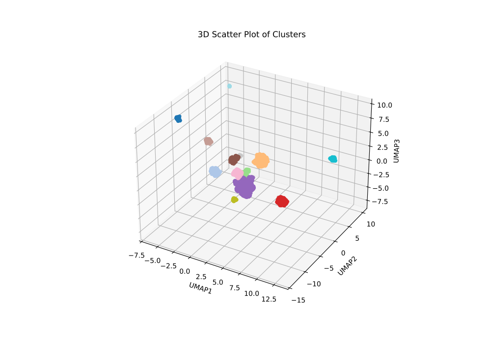
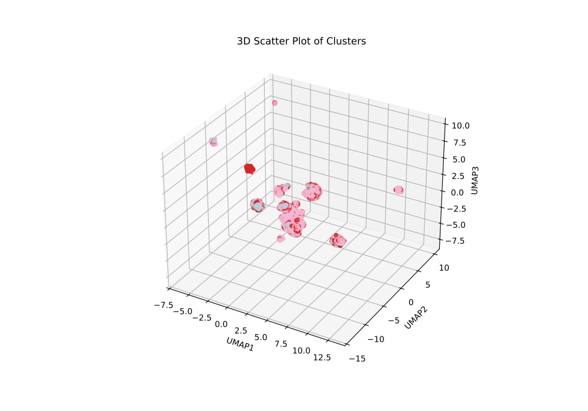
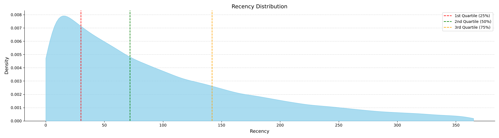

# Customer Segmentation Analysis

This project focuses on analyzing customer data to identify significant clusters that can provide insights for targeted marketing strategies. Several clustering algorithms are applied, dimensionality reduction techniques are used, and SHAP values are employed to explain the features driving each cluster's formation.

## Key Points

- **Dimensionality Reduction**: To find significant clusters, dimensionality reduction is crucial. In this analysis, UMAP (Uniform Manifold Approximation and Projection) was used to reduce the dataset to 3 components. This helps visualize the clusters in a more interpretable space, as seen in the plots below.

- **Clustering Algorithms**: Various clustering algorithms were tested, including KMeans, Agglomerative Clustering, DBSCAN, and Gaussian Mixtures. While the results were similar across the methods, DBSCAN (Density-Based Spatial Clustering of Applications with Noise) emerged as the best performer, correctly identifying 13 well-separated clusters. This was validated through higher silhouette scores compared to the other methods.

- **Silhouette Scores**: The silhouette score is a metric used to assess the quality of clustering. Higher silhouette scores indicate better-defined clusters. DBSCAN was particularly effective at identifying meaningful groupings compared to KMeans, hierarchical, and Gaussian mixture models.

- **SHAP Values for Feature Explanation**: Once clusters were identified, SHAP (SHapley Additive exPlanations) values were used to explain the most important features driving the cluster assignments. These values provide insight into how different features, such as income, ratings, and product categories, influence cluster formation.

- **Cluster Interpretation**: Despite the use of clustering algorithms, the emerging clusters mostly represent geographic separation (e.g., different states and countries). While some clusters show customer preferences related to specific product brands or regions, the clusters' interpretability is somewhat limited by the geographic patterns. A more granular approach, where clustering is applied within each country separately, may yield more insightful results.

### Final 3D Scatter Plot of Customer Segments

After completing the clustering and feature analysis, the final segmentation results show that the clusters largely align with geographic areas and customer preferences. The following plot demonstrates how customer segments are distributed across the 3D UMAP-reduced space.

## Conclusion

This analysis demonstrates the effectiveness of dimensionality reduction in visualizing customer clusters. DBSCAN performed best in identifying well-separated clusters, and SHAP values offered valuable insights into the features influencing these clusters. However, the clusters' geographic nature suggests that the model may benefit from being applied to each country separately for more actionable insights.

# Customer Segmentation with RFM Analysis

This project uses Recency, Frequency, and Monetary (RFM) analysis to segment a retail customer base based on their behavior. By calculating RFM scores and visualizing the results, we can classify customers into different segments, which helps in targeting marketing strategies effectively. In this report, we focus on visualizing the segmentation with 3D scatter plots and quartile-based divisions for further refinement.

## Steps:

### 1. **Data Cleaning**
The dataset is cleaned by removing missing values and ensuring the correct data types for key columns, such as `Transaction_ID`, `Customer_ID`, and `Date`. The date format is standardized for easier manipulation.

### 2. **RFM Computation**
The RFM analysis is performed by computing the following for each customer:

- **Recency**: Days since the last purchase.
- **Frequency**: Number of transactions.
- **Monetary**: Average spending per transaction.

These values are then converted into quartile scores, with each customer receiving a score from 1 to 4 for Recency, Frequency, and Monetary.

### 3. **Visualizing the Distribution of RFM Variables**
After computing the RFM scores, the distributions for each of the three variables (Recency, Frequency, and Monetary) are visualized. These plots help in understanding the spread of the customer base along these dimensions.

#### Recency Distribution:

#### Frequency Distribution:

#### Monetary Distribution:

These distribution plots show the quartile-based splits in the customer behavior, indicating the relative density of customers in each segment.

### 4. **Segmentation**
Based on the RFM scores, customers are classified into different segments:

- **Champion**: High Recency, Frequency, and Monetary scores.
- **Loyal**: High Frequency, but not necessarily recent or high-value customers.
- **Big Spender**: High Monetary, but low Frequency.
- **Promising**: Recently active, but low Frequency and Monetary.
- **At Risk**: Customers who have not purchased recently, but have had high past value.
- **Lost**: Inactive or disengaged customers.

The segmentation is implemented using custom rules based on the RFM scores.

### 5. **3D Visualization of Segments**
A 3D scatter plot is created to visualize the customer base segmented by Recency, Frequency, and Monetary scores. This visualization helps to understand how customers are distributed across these three dimensions.

This plot shows the different customer segments in the 3D space, where each point represents a customer, and the colors indicate their respective segment labels.

### Conclusion
RFM analysis provides an effective way to segment customers based on their behavior. By visualizing the results and dividing the customer base into meaningful segments, businesses can tailor marketing strategies to target specific customer groups.

### Files
- [RFM Distribution Plot](artifacts/imgs/RFM_distribution.png)
- [Recency Distribution Plot](artifacts/imgs/Recency.png)
- [Frequency Distribution Plot](artifacts/imgs/Frequency.png)
- [Monetary Distribution Plot](artifacts/imgs/Monetary.png)