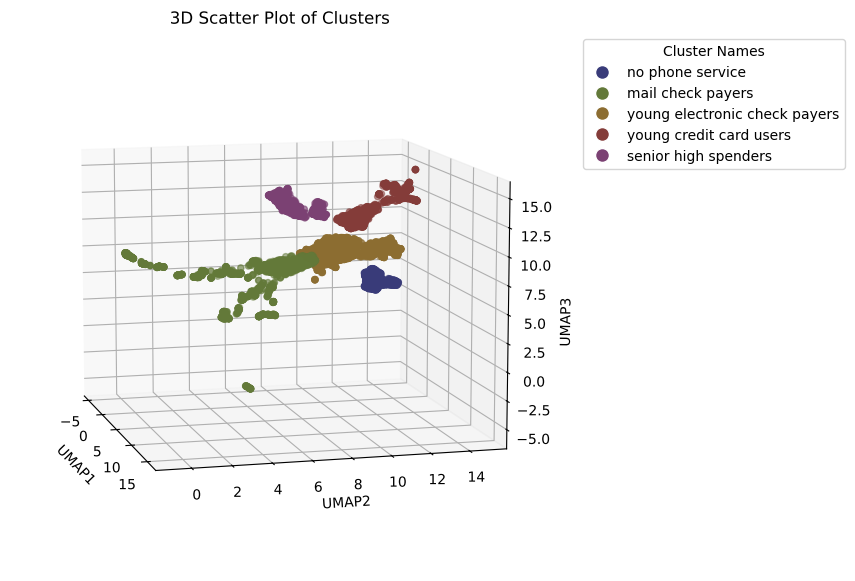
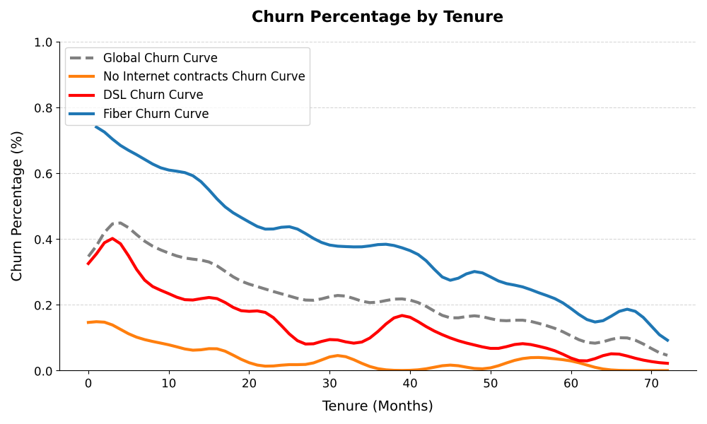
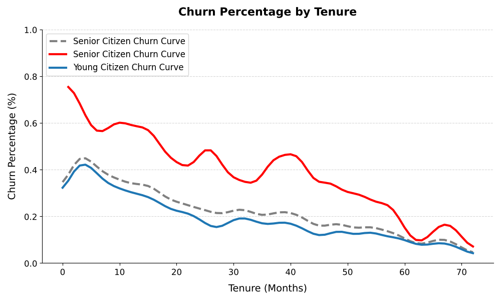

# Customer Churn Analysis: Insights and Surprising Simplicity

In this project, we explore customer churn for a telecommunications company, using both advanced and straightforward methods to reveal valuable business insights. The journey spans from cleaning data to clustering customer groups, analyzing churn tendencies, and comparing model performances. This article highlights three key findings: 

1. **Five distinct customer clusters exist in the dataset, each with unique behaviors.**
2. **Simplicity sometimes wins—logistic regression outperforms sophisticated models like XGBoost and Random Forest, even after fine-tuning.**
3. **Churn is higher among customers with fiber internet, monthly contracts, or those who are senior citizens.**

---

## Clustering: Discovering the Five Customer Groups

We applied dimensionality reduction (UMAP) and hierarchical clustering to group customers into five clusters. Each cluster represents a distinct customer archetype, including "Senior High Spenders" and "Mail Check Payers." 

### 3D Visualization of Clusters
Below is a 3D scatter plot showing these clusters, with unique colors representing each group:




These clusters help identify patterns, such as "Senior High Spenders" being more likely to churn compared to "Young Credit Card Users."

---

## Analyzing Churn Probabilities by Cluster

Next, we calculated churn probabilities for each cluster. As seen below, certain groups, like "Senior High Spenders," show significantly higher churn rates.


This allows targeted interventions for high-risk groups.

---

## Churn Curve Analysis: Key Drivers of Churn

To understand customer retention trends, we plotted churn curves across different customer attributes. 

### Churn by Internet Service
Customers with fiber internet are at a higher risk of churn compared to those with DSL or no internet service:



### Churn by Contract Type
Customers with month-to-month contracts show significantly higher churn rates than those with longer-term contracts:


### Churn by Contract Type
Senior customers display significantly higher churn rates than young people:




---

## Model Comparison: When Simplicity Triumphs

Three machine learning models were evaluated for churn prediction:

- Logistic Regression (baseline model)
- Random Forest (ensemble method)
- XGBoost (gradient boosting)

Here are their performance overviews:

#### logistic regression
```python
                precision    recall  f1-score   support

           0       0.86      0.90      0.88      1036
           1       0.68      0.58      0.63       373

    accuracy                           0.82      1409
   macro avg       0.77      0.74      0.75      1409
weighted avg       0.81      0.82      0.81      1409

AUC-ROC: 0.8606376867100728
```

#### XGBoost (fine-tuned)
```python
              precision    recall  f1-score   support

           0       0.84      0.91      0.88      1036
           1       0.69      0.53      0.60       373

    accuracy                           0.81      1409
   macro avg       0.76      0.72      0.74      1409
weighted avg       0.80      0.81      0.80      1409

AUC-ROC: 0.8622033082488846
```

#### Random Forest (fine-tuned)
```python
              precision    recall  f1-score   support

           0       0.83      0.92      0.88      1036
           1       0.70      0.49      0.58       373

    accuracy                           0.81      1409
   macro avg       0.77      0.71      0.73      1409
weighted avg       0.80      0.81      0.80      1409

AUC-ROC: 0.8658999865434182
```

While fine-tuned XGBoost and Random Forest perform slightly better on the AUC-ROC metric, f1-scores show that logistic regression have a better performance overall. In particular, in a churn model it is important to have high recall for the churn class: if I miss some at-risk customers and they end up churning because I did not perform a caring action on them, I could lose a lot of value.

In conclusion, despite the advanced techniques and hyperparameter tuning applied to Random Forest and XGBoost, Logistic Regression achieved comparable—and sometimes superior—results. This reinforces the principle that **a simple, interpretable model can often outperform more complex alternatives**.

A shap analysis shows that the riskier customers are those with fiber, a short tenure, month-to-month contracts and, interestingly, lower monthly charges

---

## Conclusion: Finding churning customers

This analysis demonstrates the power of combining simple models with thoughtful data exploration. Businesses can use these findings to:
- Target high-risk clusters with tailored strategies.
- Offer incentives for customers with month-to-month contracts to switch to long-term plans.
- Improve customer experience for fiber internet users to reduce churn rates.

By focusing on both granular insights (customer clusters) and high-level trends (churn curves), we’ve paved the way for actionable strategies that drive retention.

For any questions or to collaborate, feel free to reach out!