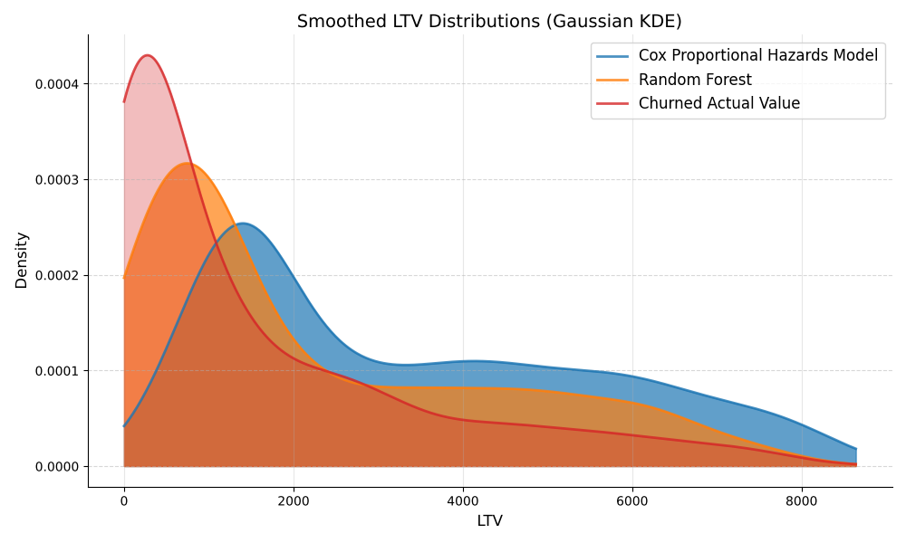
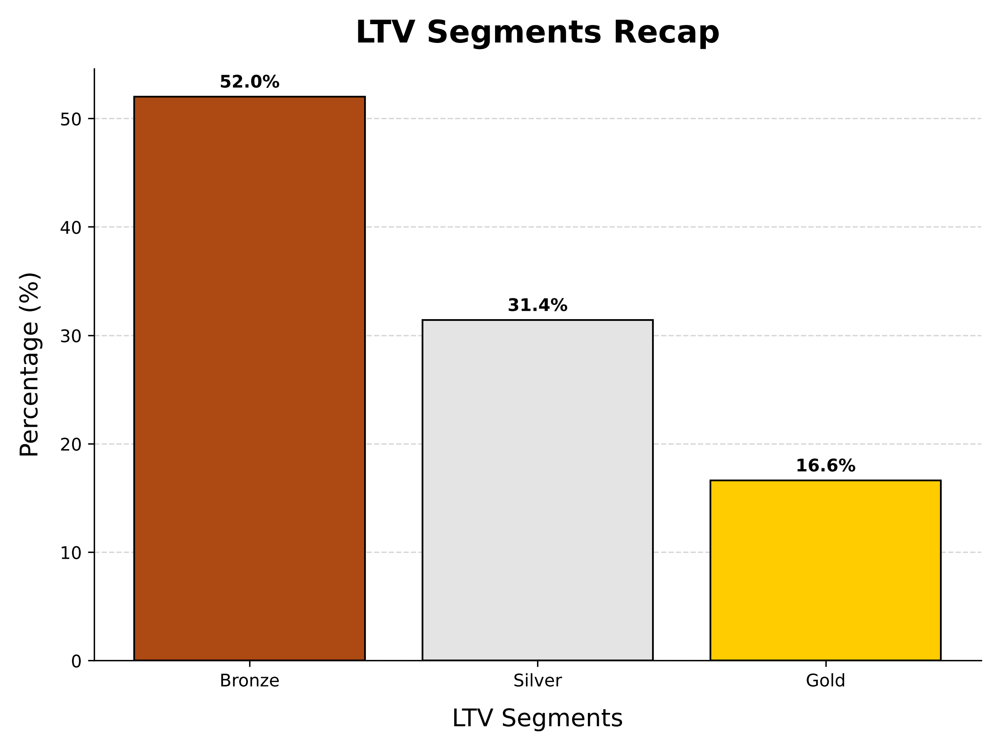
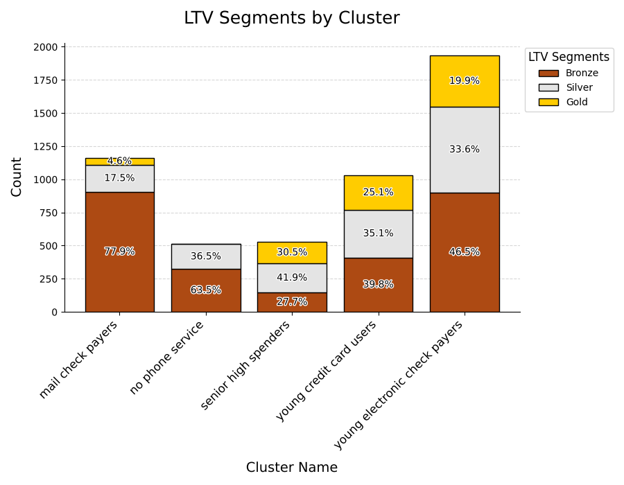

# Customer Churn and LTV Analysis

This project analyzes customer churn and computes the **Lifetime Value (LTV)** of customers using various methodologies. The goal is to segment the customer base and identify patterns that can help retain customers and maximize revenue.

## Key Insights
1. **Cohort Analysis for Churn Trends**:
   - Cohort analysis reveals that the **churn rate decreases with customer tenure**.
   - Longer-tenured customers are less likely to churn compared to new customers.

```
tenure_cohort
0 - 12          0.476782
12 - 24         0.287109
25+             0.140360
```

2. **LTV Estimation Methods**:
   - **Regression-Based Approach**: A Random Forest regressor is trained on the final tenures of churned customers to predict the expected tenure of active customers.
   - **Survival Analysis**: Kaplan-Meier and Cox Proportional Hazards methods estimate the survival probability of customers, avoiding censoring issues.

3. **LTV Distribution Comparison**:
   - Regression-based LTV estimates are **skewed towards lower values**, favoring fast-churning customers.
   - Survival analysis produces LTV estimates that better reflect the **total customer base**.
   
   

4. **LTV Segmentation**:
   - Customers are segmented into **Bronze**, **Silver**, and **Gold** tiers based on their LTV.

```
Bronze  52%
Silver  31.4%
Gold    16.6%
```

   

5. **Clusters vs. LTV Segments**:
   - Cluster analysis shows that a significan fraction of Mail Check Payers and customers with No Phone Service are Bronze
   - Gold and Silver are concentrated in **higher-value clusters**, in fact more than 70% of Senior High Spenders are Silver or Gold. These segments also represent more than 50% of the Young Credit Card users and Electronic Check Payers.
   
   

## Analysis Steps

### 1. Data Preprocessing
- Cleaned missing values and normalized columns.
- Dummified categorical variables for modeling.

### 2. Cohort Analysis
- Grouped customers into tenure-based cohorts (`0-12 months`, `12-24 months`, and `25+ months`).
- Examined churn rates within each cohort.

### 3. LTV Computation

#### Regression-Based Approach
- Trained a Random Forest Regressor to predict total tenure for active customers.
- Computed LTV as `predicted tenure × monthly charges`.

#### Survival Analysis
- Used **Kaplan-Meier** and **Cox Proportional Hazards** models to predict survival probabilities.
- Estimated expected tenure and computed LTV as `expected tenure × monthly charges`.

### 4. LTV Segmentation
- Segmented customers into **Bronze**, **Silver**, and **Gold** tiers based on LTV thresholds:
  - **Bronze**: LTV < 3000
  - **Silver**: 3000 ≤ LTV < 6000
  - **Gold**: LTV ≥ 6000

### 5. Clustering Comparison
- Compared LTV segments with customer clusters obtained from previous analyses.
- Identified overlaps and distinctions between **LTV segments** and **clusters**.

## Conclusion
- **Cohort Analysis** highlights that customer tenure strongly influences churn rates.
- **Regression-based LTV** is useful but tends to underestimate long-term customers' value.
- **Survival Analysis** offers a more robust estimate of LTV for the entire customer base.
- Segmentation insights enable targeted marketing strategies:
  - Retain **Gold customers** by enhancing high-value offerings.
  - Upsell or retain **Bronze customers** to move them into higher LTV tiers.

## Visualization
- Figures and plots are saved under the `artifacts/imgs/` directory.

## Files
- **`data/raw/WA_Fn-UseC_-Telco-Customer-Churn.csv`**: Raw customer data.
- **`data/raw/telco_clusters.csv`**: Clustered customer data.
- **`artifacts/imgs/`**: Generated visualizations.