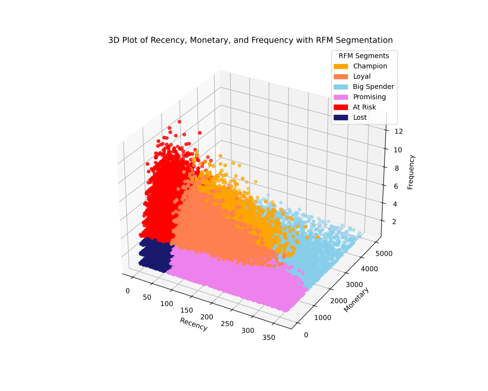

# Customer Analytics Portfolio

Welcome to my Customer Analytics portfolio! This repository showcases various analyses, models, and techniques applied in customer analytics. Each project is designed to demonstrate practical applications in understanding and predicting customer behavior, optimizing marketing strategies, and enhancing business outcomes.

---

## Table of Contents

1. [Customer Segmentation](#customer-segmentation)
2. [Customer Churn Prediction](#customer-churn-prediction)
3. [Customer Lifetime Value (CLV)](#customer-lifetime-value-clv)
4. [Recommendation Systems](#recommendation-systems)
5. [Sentiment Analysis and Text Mining](#sentiment-analysis-and-text-mining)
6. [Marketing Analytics](#marketing-analytics)
7. [Predictive Analytics for Sales and Demand](#predictive-analytics-for-sales-and-demand)
8. [Customer Journey Analysis](#customer-journey-analysis)
9. [Social Network and Graph Analysis](#social-network-and-graph-analysis)
10. [Behavioral Analytics](#behavioral-analytics)
11. [Advanced Modeling Techniques](#advanced-modeling-techniques)

---

## [Customer Segmentation](01-customer-segmentation/)

**Techniques:**  
- K-Means Clustering  
- Hierarchical Clustering
- DBSCAN Clustering
- Gaussian Mixtures
- RFM

**Description:**  
Projects in this section group customers based on features like demographics, purchase history, and engagement levels. Visualizations such as cluster plots and detailed customer profiles are included.

Download the necessary dataset from kaggle at [retail analysis large dataset](https://www.kaggle.com/datasets/sahilprajapati143/retail-analysis-large-dataset).




---

## Customer Churn Prediction

**Techniques:**  
- Logistic Regression  
- Decision Trees, Random Forests, Gradient Boosting (e.g., XGBoost, LightGBM)  
- Neural Networks  

**Description:**  
This section includes models identifying customers likely to leave, helping businesses implement proactive retention strategies. Tools like SHAP and LIME are used for interpretability.

Download the necessary dataset from kaggle at [telco customer churn](https://www.kaggle.com/datasets/blastchar/telco-customer-churn).
---

## Customer Lifetime Value (CLV)

**Techniques:**  
- Cohort Analysis  
- Regression-Based CLV Models  
- Probabilistic Models (e.g., BG/NBD, Gamma-Gamma)  
- Monte Carlo Simulations  

**Description:**  
These projects predict the long-term value of customers and help prioritize customer retention strategies.

---

## Recommendation Systems

**Techniques:**  
- Collaborative Filtering (User-User, Item-Item)  
- Matrix Factorization (SVD, ALS)  
- Content-Based Filtering  
- Hybrid Models  

**Description:**  
These projects provide personalized recommendations to customers using purchase history, product attributes, and hybrid modeling techniques.

---

## Sentiment Analysis and Text Mining

**Techniques:**  
- NLP Tools (TF-IDF, Word2Vec)  
- Sentiment Classification (Naive Bayes, LSTMs, BERT)  
- Topic Modeling (LDA)  

**Description:**  
Analyze customer reviews, comments, and support tickets to derive actionable insights and understand customer sentiment.

---

## Marketing Analytics

**Techniques:**  
- A/B Testing  
- Marketing Mix Models (MMM)  
- Uplift Modeling  

**Description:**  
Optimize marketing strategies and assess campaign effectiveness with statistical tests and predictive models.

---

## Predictive Analytics for Sales and Demand

**Techniques:**  
- Time Series Analysis (ARIMA, SARIMA, Prophet)  
- Regression with Seasonality  
- LSTM for Sequential Data  

**Description:**  
These projects forecast customer demand and sales trends, helping businesses optimize inventory and resource allocation.

---

## Customer Journey Analysis

**Techniques:**  
- Funnel Analysis  
- Path Analysis (Markov Chains, Sankey Diagrams)  

**Description:**  
Understand customer touchpoints and conversion rates at each stage of the customer journey.

---

## Social Network and Graph Analysis

**Techniques:**  
- Community Detection Algorithms  
- Influence Propagation Models  
- Centrality Metrics (PageRank, Betweenness Centrality)  

**Description:**  
Analyze customer interactions and influence patterns in social or transactional networks.

---

## Behavioral Analytics

**Techniques:**  
- Predictive Models for Purchase Frequency or Basket Size  
- Sequence Modeling for Repeat Behavior  
- Behavioral Scoring Models  

**Description:**  
Study customer actions to predict future behavior and optimize targeted interventions.

---

## Advanced Modeling Techniques

**Techniques:**  
- Deep Learning (e.g., CNNs for customer image data)  
- Reinforcement Learning for Pricing/Personalization  
- Bayesian Networks  

**Description:**  
Showcase innovative approaches to solving complex customer analytics challenges.

---

## How to Use This Repository

1. Clone the repository:
   ```bash
   git clone git@github.com:stefanofranzini/customer-analytics.git
   ```
2. Navigate to the desired project folder.
3. Follow the README.md file in each folder for detailed instructions on running the code.
